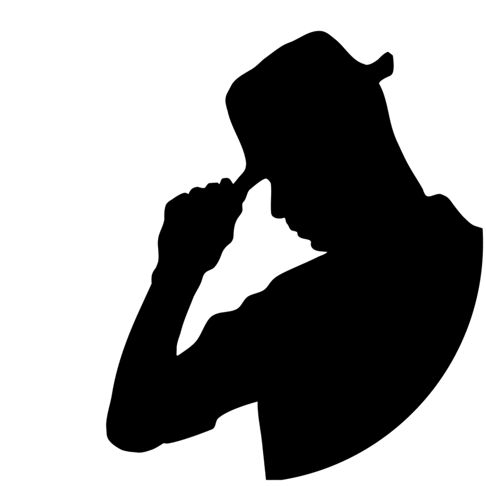

# Heading Level 1

## Heading Level 2

### Heading Level 3

#### Heading Level 4

##### Heading Level 5

###### Heading Level 6

## Basic Formatting

This is a paragraph with **bold text**, _italic text_, and **_bold italic text_**.

This is a ~~strikethrough text~~ example.

## Lists

### Unordered Lists

* Item 1
* Item 2
  * Nested item 2.1
  * Nested item 2.2
* Item 3

### Ordered Lists

1. First item
2. Second item
   1. Nested item 2.1
   2. Nested item 2.2
3. Third item

## Links and Images

[Link to GitHub](https://github.com)



## Blockquotes

> This is a blockquote.
>
> It can span multiple paragraphs.
>
> > And it can be nested.

## Code

Inline code: `const example = "hello world";`

Code block with syntax highlighting:

```javascript
function greet(name) {
  console.log(`Hello, ${name}!`);
  return true;
}

// Call the function
greet("World");
```

## Tables

| Header 1 | Header 2 | Header 3 |
|----------|----------|----------|
| Cell 1   | Cell 2   | Cell 3   |
| Cell 4   | Cell 5   | Cell 6   |
| Cell 7   | Cell 8   | Cell 9   |


## Horizontal Rule

---

## HTML in Markdown

<div style="padding: 20px; background-color: #f0f0f0; border-radius: 8px;">
  <h3>This is HTML embedded in Markdown</h3>
  <p>You can use <strong>HTML</strong> for more complex formatting.</p>
</div>

## Line Breaks

This is the first line.  
And this is the second line.

## Footnotes

Here's a sentence with a footnote. [^1]

[^1]: This is the footnote.

## Emojis

:smile: :heart: :rocket:

## Definition Lists

Term
: Definition

Another term
: Another definition

## Custom Class

<div className="bg-gray-100 p-4 rounded-lg my-4">
  <h3 className="text-lg font-bold">Custom Styled Box</h3>
  <p>This box uses custom TailwindCSS classes</p>
</div>

## Mathematical Expressions

When $a \ne 0$, there are two solutions to $(ax^2 + bx + c = 0)$ and they are 
$x = {-b \pm \sqrt{b^2-4ac} \over 2a}$ 